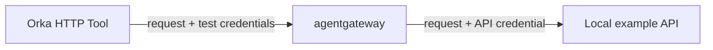
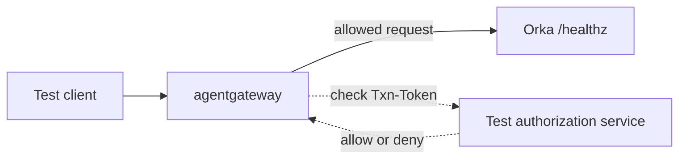

# Orka + agentgateway

This repository is a runnable example of connecting [Orka](https://github.com/orka-agents/orka) to [agentgateway](https://github.com/agentgateway/agentgateway). It includes the Kubernetes configuration and an automated test that installs both projects and checks real HTTP requests between them.

Orka runs AI agents on Kubernetes. An agent can use an HTTP **Tool**, an Orka resource that describes an API request, such as a `POST` to a service. **agentgateway** sits in the request path and applies routing and authentication rules before forwarding the request.

The example demonstrates two separate uses of the gateway:

- **Requests leaving Orka:** send a Tool's HTTP request through agentgateway, which supplies the credential for the destination API.
- **Requests entering Orka:** ask an authorization service to check a transaction token before forwarding the request to Orka.

The demo uses local test services and generated credentials. You can run it without an LLM API key or credentials for an external API.

## How a Tool calls an API through the gateway

Suppose an Orka Tool needs to send a request to an API. The Tool describes the request, and an `OutboundAccessPolicy` tells Orka which gateway to connect to.



In this example:

1. The Tool requests `POST https://example.com/v1/resource?version=1` and references the `agentgateway` policy.
2. Orka reads that policy and connects to the gateway's Kubernetes Service, `orka-egress:8080`. It keeps the original hostname, path, query, method, and request body.
3. The gateway matches the hostname and path to an `HTTPRoute`, a Kubernetes resource that maps incoming requests to a destination service.
4. The gateway replaces the `Authorization` header with an API credential stored in a Kubernetes Secret. It also removes `Txn-Token`, the transaction-token header, before forwarding the request.
5. The local example API reports what arrived so the test can check the request and credentials without printing secret values.

`example.com` is a routing label in this demo. The gateway sends the request to a service inside the test cluster; it does not contact the public `example.com` website.

### The configuration that connects this to Orka

The integration uses Orka's existing Kubernetes APIs. The connection is `spec.http.outboundAccessPolicyRef` on the Tool. It points to an `OutboundAccessPolicy`, which points to the gateway Service. The policy applies to the HTTP Tools that reference it.

The [complete example](examples/outbound-access-policy.yaml) contains these two resources:

```yaml
apiVersion: core.orka.ai/v1alpha1
kind: OutboundAccessPolicy
metadata:
  name: agentgateway
  namespace: orka-system
spec:
  gateway:
    serviceRef:
      name: orka-egress
      namespace: orka-system
      port: 8080
    scheme: http
---
apiVersion: core.orka.ai/v1alpha1
kind: Tool
metadata:
  name: downstream-api
  namespace: orka-system
spec:
  description: Calls a downstream API through agentgateway
  http:
    url: https://example.com/v1/resource?version=1
    method: POST
    outboundAccessPolicyRef:
      name: agentgateway
```

The gateway also needs its own routes and policies. The [gateway manifests](manifests/overlays/v1.3.1) create the listener, map requests to the destination services, and configure credential injection and authorization. The demo script installs all of these resources for you.

Orka, its Tools and policies, the gateway Service, and the test services all live in the `orka-system` namespace. This follows Orka's rule that these Service references stay in its namespace. The agentgateway controller, which configures the gateway, runs separately in `agentgateway-system`.

## How the gateway checks requests entering Orka

The second flow checks requests sent to Orka through the gateway. Before forwarding a request, agentgateway asks a separate authorization service whether to allow it.



The test requests `/healthz` using the hostname `orka.example.test`. The gateway's `orka` route forwards it to Orka's Service. That endpoint reports whether Orka is running.

- The generated test token allows the request through.
- A missing or incorrect token produces HTTP `403 Forbidden`.
- If the authorization service is unavailable, the gateway denies the request. This is **fail-closed** behavior: a failed check does not grant access.

This incoming check is separate from the credential replacement on outgoing Tool calls. The test authorization service only compares the supplied token with a generated value. A real token verifier would also need to check the token's signature, issuer, intended recipient, expiry, and permissions.

## Run the demo

### Prerequisites

Have these tools installed and available in your terminal:

| Tool | What it does here |
| --- | --- |
| Docker, running | Runs the local cluster and builds Orka's container images. |
| Kind v0.29.0 | Creates a Kubernetes cluster inside Docker. |
| kubectl | Applies configuration to Kubernetes and checks the resources. |
| Helm v3.19.0 | Installs the Orka and agentgateway packages. |
| Go 1.27.1 | Builds the test program against Orka's source code. |
| Git, curl, OpenSSL, jq | Fetch source and packages, generate test credentials, and process configuration. |

The run downloads source code and container images, so it needs internet access. It builds Orka's controller and workspace publisher images, including the UI; allow several minutes for the first run.

### Start the test

Clone this repository and run the script from its root directory:

```bash
git clone https://github.com/orka-agents/orka-integration-agentgateway.git
cd orka-integration-agentgateway
ORKA_REF=main ./scripts/kind-ci.sh
```

The script:

1. Creates a temporary local Kubernetes cluster and image registry.
2. Fetches Orka's `main` branch, builds its images, and installs its matching Helm chart.
3. Installs agentgateway, the example Tool and policies, and the local test services.
4. Runs a test program using Orka's real policy resolver and HTTP Tool executor, the code that selects the gateway and sends a Tool's request.
5. Checks both request paths, including missing tokens and an unavailable authorization service.
6. Removes its cluster, registry, and temporary files when it exits.

A successful run prints:

```text
Orka main and agentgateway conformance passed.
```

Success means every check in [What a passing run proves](#what-a-passing-run-proves) passed. The script uses a private Kubernetes connection file, called a kubeconfig, and leaves your usual cluster configuration unchanged. It refuses to replace an existing cluster with the same name. The default run is self-cleaning, so it does not leave a running demo behind.

### Test your local Orka checkout

To test Orka from `~/projects/orka`, run this from the integration repository:

```bash
ORKA_REPOSITORY="$HOME/projects/orka" ORKA_REF=main ./scripts/kind-ci.sh
```

`ORKA_REF` can also be a branch name, tag, or commit. The script fetches that committed revision into a temporary checkout; uncommitted local edits are not included, and the source checkout is left unchanged.

This integration uses Orka's chart at `manifest_staging/charts/orka` because it contains the current Tool and outbound-policy APIs. Version pins and installation requirements are in [Compatibility](docs/compatibility.md).

<details>
<summary>Use an existing dedicated Kind cluster</summary>

Set `KIND_EXISTING_CLUSTER=true`, `KIND_CLUSTER_NAME`, and an explicit `KUBECONFIG` whose current context is `kind-$KIND_CLUSTER_NAME`. The script installs the integration into that cluster and retains the cluster afterward, but still removes its temporary image registry. Use a disposable cluster dedicated to this test, not a shared or production cluster.

</details>

## What a passing run proves

- Orka accepts the example Tool and policy and resolves the gateway Service.
- The Tool's method, hostname, path, query, body, and idempotency key reach the destination unchanged. An idempotency key is a request identifier that an API can use to recognize retries.
- The gateway replaces the outgoing API credential and removes the transaction token.
- Incoming requests require the expected test token, and authorization-service failure denies access while Orka stays healthy.
- Requests for an unconfigured hostname have no matching route.

The test exercises HTTP Tool execution and Orka's health endpoint. It does not run a complete agent Task, call tools through the Model Context Protocol, or perform OAuth token exchange. The [Entra on-behalf-of example](examples/entra-obo-mock.yaml) records request fields only. The demo uses generated credentials and an HTTP gateway listener; it is a compatibility test and a starting point for configuring your own integration.

## Where to look next

| File or directory | Start here to... |
| --- | --- |
| [Orka policy and Tool example](examples/outbound-access-policy.yaml) | Connect an HTTP Tool to the gateway. |
| [Gateway routes](manifests/overlays/v1.5.0/routes.yaml) | Choose which hostnames and paths reach each service. |
| [API credential policy](manifests/overlays/v1.5.0/backend-resource-auth.yaml) | Configure the Secret used for the destination API's credential. |
| [Incoming authorization policy](manifests/overlays/v1.5.0/ext-authz-transaction-token.yaml) | Connect the gateway to a token-checking service. |
| [Detailed flows](docs/flows.md) and [compatibility requirements](docs/compatibility.md) | Understand the protocol details, tested versions, and namespace rules. |
| [Contributing](CONTRIBUTING.md) | Run the checks before changing this integration. |
